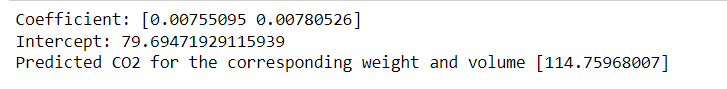

# Implementation of Multivariate Linear Regression
## Aim
To write a python program to implement multivariate linear regression and predict the output.
## Equipment’s required:
1.	Hardware – PCs
2.	Anaconda – Python 3.7 Installation / Moodle-Code Runner
## Algorithm:
### Step 1:

Import the Pandas module.
The Pandas module allows us to read csv files and return a DataFrame object.

### Step 2:
Import linear_model.
From the sklearn module we will use the LinearRegression() method to create a linear regression object.


### Step 3:

Then make a list of the independent values and call this variable X.

Put the dependent values in a variable called y.
### Step 4:
This object has a method called fit() that takes the independent and dependent values as parameters and fills the regression object with data.

regr = linear_model.LinearRegression()
regr.fit(x,y)
### Step 5 :

 Regression Object to predict CO2 values based on a car's weight and volume:
 
 predictedCO2=regr.predict([[3300,1300]])

## Program:
```
import pandas as pd
from sklearn import linear_model
df = pd.read_csv("cars.csv")
x=df[['Weight','Volume']]
y=df['CO2']
regr = linear_model.LinearRegression()
regr.fit(x,y)
print("Coefficient:",regr.coef_)
print("Intercept:",regr.intercept_)
predictedCO2=regr.predict([[3300,1300]])
print("Predicted CO2 for the corresponding weight and volume",predictedCO2)

```
## Output:
### Insert your output


<br>

## Result
Thus the multivariate linear regression is implemented and predicted the output using python program.